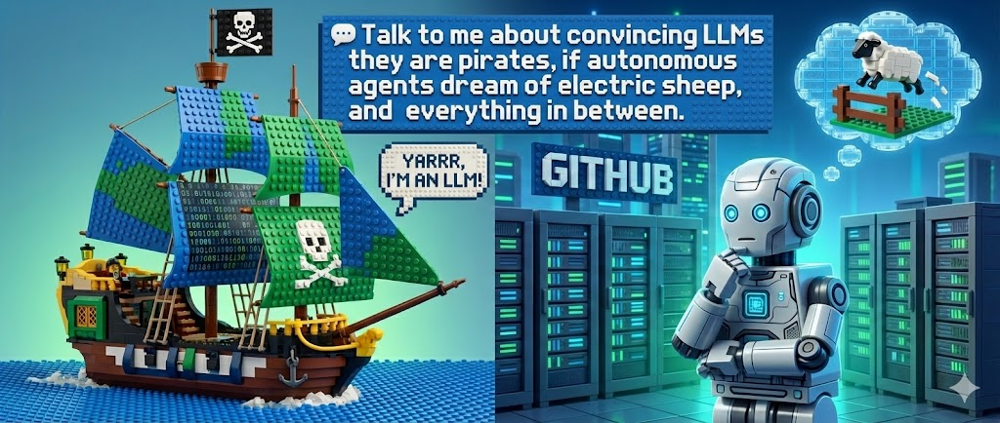

  

 

# Hi 👋, I'm Alexander.

Focused on **Autonomous Intelligence** and **Secure Architectures**. I build tools that make complex systems safer and smarter.

### Academia
- 🎓 **Doctoral Student** @ Purdue University
- 🎓 **M.S.** from Georgia Tech

### Work
- 🛡️ **Security Engineering** @ Google
- 💼 **Previously:** MITRE, Walt Disney Imagineering

### 💬 Talk to me about **convincing LLMs they are pirates**, if **autonomous agents dream of electric sheep**, and everything in between.
- 🤖 **AI Security:** Adversarial AI, Agentic AI, LLM Security
- 🧠 **Core:** Deep Learning, Machine Learning
- 🌐 **Domains:** Offensive Security, Fintech, Distributed Ledgers

<!--
**alexanderkent/alexanderkent** is a ✨ _special_ ✨ repository because its `README.md` (this file) appears on your GitHub profile.

Here are some ideas to get you started:

- 🔭 I’m currently working on things
- 🌱 I’m currently learning things
- 👯 I’m looking to collaborate on things
- 🤔 I’m looking for help with things
- 💬 Ask me about things
- 📫 How to reach me: here
- 😄 Pronouns: he/him
- ⚡ Fun fact: things
-->
