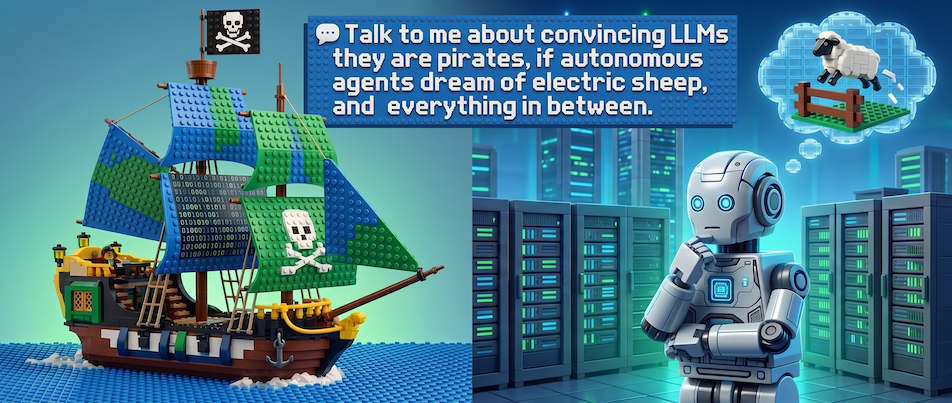

  

 

# Hi 👋, I'm Alexander.

I work on offensive security for AI systems, mostly agents and the
evaluation problems they create.

### Where I am

- 🎓 Doctoral student @ Purdue
- 🛡️ Security engineering @ Google
- 🎓 M.S. @ Georgia Tech
- 💼 Previously: MITRE, Walt Disney Imagineering

### Open questions I'm stuck on

- How do you evaluate an agent that can tell it's being evaluated?
- Why does faithfulness hold under recall and break under synthesis?
- What does an agent's kill chain look like when the reconnaissance is free?
- At what point does an autonomous attacker stop being a faster human and start being a different adversary?

### 💬 Ask me about things
- 🤖 **AI Security:** Adversarial AI, Agentic AI, LLM Security
- 🧠 **Core:** Deep Learning, Machine Learning
- 🌐 **Domains:** Offensive Security, Fintech, Distributed Ledgers
